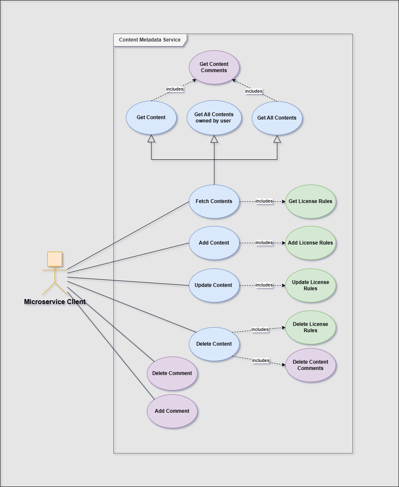
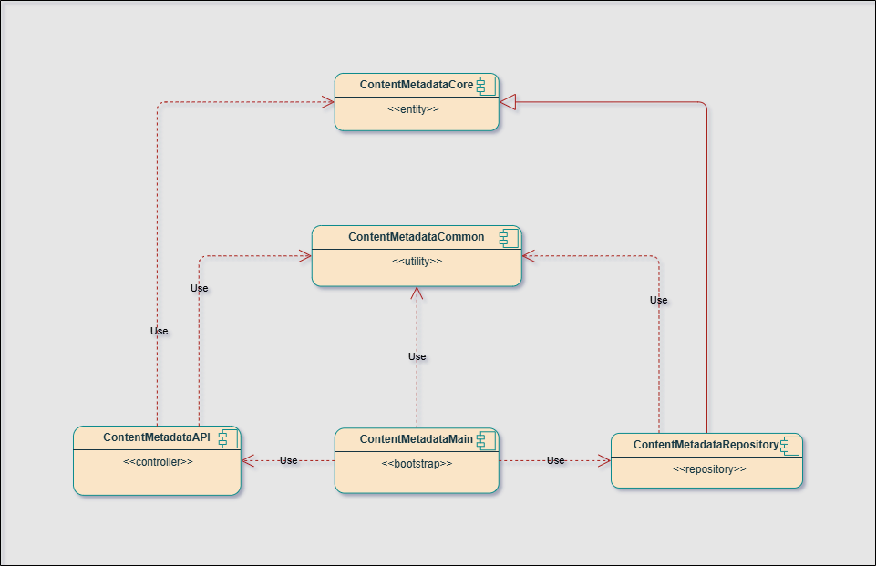
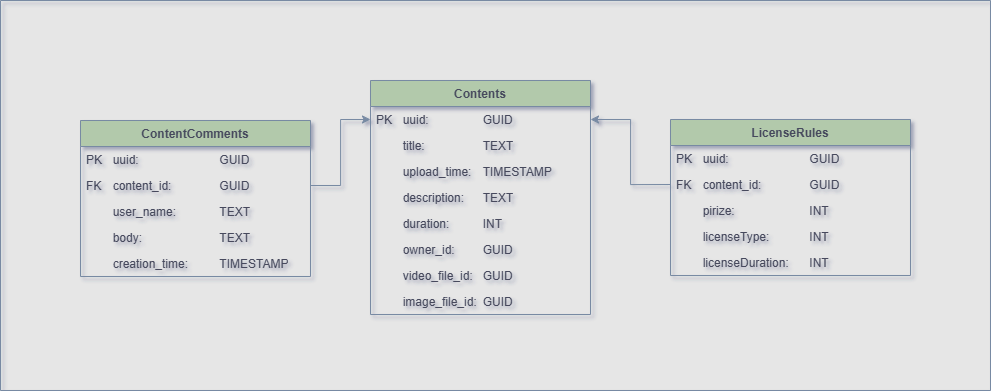

# ContentMetadata Service Documentation

This document provides a detailed overview of the ContentMetadataService, including its core features, data structure, query formats, component architecture, and database design.

## Table of Contents

- [Core Features](#core-features)
- [Request and JSON Data Structure](#request-and-json-data-structure)
- [Component Architecture](#component-architecture)
- [Database Architecture](#database-architecture)

---

## Core Features

ContentMetadataService provides essential metadata management functions that support various other microservices within the streaming platform. While it doesn't directly interact with users, it plays a vital role in enabling metadata-driven features across the platform. 

Below are the key features of the service:

- **Content Metadata Management**: Handles storing, retrieving, and updating metadata for content items (e.g., movies, series, courses) along with the associated licensing rules.
- **Content Comments Management**: Manages the storage and retrieval of user comments linked to specific content.
- **CRUD Operations**: Supports simple Create, Read, Update, and Delete (CRUD) operations on content metadata, license rules, and content comments.

The following use case diagram illustrates the core operations available within the service:



> **Note**: In this diagram, the actor represents other internal microservice (e.g. APIGateway).
## Request and JSON Data Structure

The service accepts and returns data in JSON format.

### Enums Definitions

Before diving into specific request examples, it's important to have an overview of the enums used for license-related data:

#### LicenseType Enum
`LicenseType` defines the type of license associated with the content. The following values are supported:

- `1`: **Rent** - The content can be rented for a limited period.
- `2`: **Buy** - The content can be purchased and owned permanently by the user.

#### LicenseDuration Enum
`LicenseDuration` specifies the length of time for which the license is valid (ignored when "Buy" license type appears in the license rule object). The following values are commonly used:

- `1`: **OneDay** - The license is valid for 24 hours from the time of purchase.
- `2`: **TwoDays** - The license is valid for two days.
- `3`: **ThreeDays** - The license is valid for three days.
- `4`: **OneWeek** - The license is valid for one week.
- `5`: **OneMonth** - The license is valid for 30 days.

### Example Requests and Responses

Below are examples of typical request and response structures for key operations:

### **Content Metadata**

#### Create Content

- **Method**: `POST`
- **Endpoint**: `/content`

**Request**:

```json
{
    "uuid": "123e4567-e89b-12d3-a456-426614175000",
    "title": "Amazing Video 2",
    "upload_time": "2024-09-25T14:00:00Z",
    "duration": 3600,
    "description": "This is a detailed description of the amazing video content.",
    "license_rules": [
        {
            "uuid": "987e4567-e99b-12d3-a456-426614174000",
            "price": 49,
            "type": 1,
            "duration": 1,
            "content_id": "123e4567-e89b-12d3-a456-426614175000"
        }
    ],
    "owner_id": "456e4567-e89b-12d3-a456-426614174003",
    "video_file_id": "789e4567-e89b-12d3-a456-526614174004",
    "image_file_id": "789e4567-e89b-12d3-a456-626614174005"
}
```

**Response**:

```json
{
    "uuid": "123e4567-e89b-12d3-a456-426614175000"
}
```

---

#### Update Content

- **Method**: `PUT`
- **Endpoint**: `/content/{id}`

**Request**:

```json
{
    "uuid": "123e4567-e89b-12d3-a456-426614175000",
    "title": "Nice Title",
    "upload_time": "2024-09-25T14:00:00Z",
    "duration": 3600,
    "description": "This is a detailed description of the amazing video content.",
    "license_rules": [
        {
            "uuid": "987e4567-e99b-12d3-a456-426614174000",
            "price": 49,
            "type": 1,
            "duration": 1,
            "content_id": "123e4567-e89b-12d3-a456-426614175000"
        }
    ],
    "owner_id": "456e4567-e89b-12d3-a456-426614174003",
    "video_file_id": "789e4567-e89b-12d3-a456-526614174004",
    "image_file_id": "789e4567-e89b-12d3-a456-626614174005"
}
```

**Response**:

```text
Content updated successfully
```

---

#### Delete Content

- **Method**: `DELETE`
- **Endpoint**: `/content/{id}`

**Request**:

```
DELETE /content/123e4567-e89b-12d3-a456-426614175000
```

**Response**:

```text
Content removed successfully.
```

---

#### Read All Contents

- **Method**: `GET`
- **Endpoint**: `/content`
- **Query Parameters**:
  - `offset` (optional): Defines the starting point for pagination. Default is `0`.
  - `limit` (optional): Specifies the number of content items to return. Default is `0`. When set to `0`, all records from the specified offset are returned.

**Example Request**:

```
GET /content?offset=0&limit=10
```

**Response**:

```json
{
    "contents": [
        {
            "uuid": "123e4567-e89b-12d3-a456-426614175000",
            "title": "Amazing Video",
            "upload_time": "2024-09-25T12:00:00Z",
            "duration": 3600,
            "description": "This is a detailed description of the amazing video content.",
            "license_rules": [
                {
                    "uuid": "987e4567-e99b-12d3-a456-426614174000",
                    "price": 49,
                    "type": 1,
                    "content_id": "123e4567-e89b-12d3-a456-426614175000",
                    "duration": 1
                }
            ],
            "owner_id": "456e4567-e89b-12d3-a456-426614174003",
            "video_file_id": "789e4567-e89b-12d3-a456-526614174004",
            "image_file_id": "789e4567-e89b-12d3-a456-626614174005"
        },
        {
            "uuid": "123e4567-e89b-12d3-a456-426624175000",
            "title": "Amazing Video 2",
            "upload_time": "2024-09-25T12:00:00Z",
            "duration": 3600,
            "description": "This is a detailed description of the amazing video content.",
            "license_rules": [
                {
                    "uuid": "987e4567-e99b-12d3-a456-426614174000",
                    "price": 49,
                    "type": 1,
                    "content_id": "123e4567-e89b-12d3-a456-426614175000",
                    "duration": 1
                }
            ],
            "owner_id": "456e4567-e89b-12d3-a456-426614174003",
            "video_file_id": "789e4567-e89b-12d3-a456-526614174004",
            "image_file_id": "789e4567-e89b-12d3-a456-626614174005"
        }
    ]
}
```

---

#### Read Content by ID

- **Method**: `GET`
- **Endpoint**: `/content/{id}`

**Request**:

```
GET /content/123e4567-e89b-12d3-a456-426614175000
```

**Response**:

```json
{
    "uuid": "123e4567-e89b-12d3-a456-426614175000",
    "title": "Amazing Video",
    "upload_time": "2024-09-25T12:00:00Z",
    "duration": 3600,
    "description": "This is a detailed description of the amazing video content.",
    "license_rules": [
        {
            "uuid": "987e4567-e99b-12d3-a456-426614174000",
            "price": 49,
            "type": 1,
            "content_id": "123e4567-e89b-12d3-a456-426614175000",
            "duration": 1
        }
    ],
    "owner_id": "456e4567-e89b-12d3-a456-426614174003",
    "video_file_id": "789e4567-e89b-12d3-a456-526614174004",
    "image_file_id": "789e4567-e89b-12d3-a456-626614174005"
}
```

---

#### Read Content by Author ID

- **Method**: `GET`
- **Endpoint**: `/content/author/{author_id}`

**Request**:

```
GET /content/author/456e4567-e89b-12d3-a456-426614174003
```

**Response**:

```json
{
    "contents": [
        {
            "uuid": "123e4567-e89b-12d3-a456-426614175000",
            "title": "Amazing Video",
            "upload_time": "2024-09-25T12:00:00Z",
            "duration": 3600,
            "description": "This is a detailed description of the amazing video content.",
            "license_rules": [
                {
                    "uuid": "987e4567-e99b-12d3-a456-426614174000",
                    "price": 49,
                    "type": 1,
                    "content_id": "123e4567-e89b-12d3-a456-426614175000",
                    "duration": 1
                }
            ],
            "owner_id": "456e4567-e89b-12d3-a456-426614174003",
            "video_file_id": "789e4567-e89b-12d3-a456-526614174004",
            "image_file_id": "789e4567-e89b-12d3-a456-626614174005"
        }
    ]
}
```

---

### **Content Comments**

#### Create Comment

- **Method**: `POST`
- **Endpoint**: `/comment`

**Request**:

```json
{
    "uuid": "567e4567-e89b-12d3-a456-426614174001",
    "body": "This is a comment on the content.",
    "creation_time": "2024-09-25T15:30:00Z",
    "content_id": "123e4567-e89b-12d3-a456-426614175000",
    "user_name": "john_doe"
}
```

**Response**:

```json
{
    "uuid": "567e4567-e89b-12d3-a456-426614174001"
}
```

---

#### Delete Comment

- **Method**: `DELETE`
- **Endpoint**: `/comment/{id}`

**Request**:

```
DELETE /comment/567e4567-e89b-12d3-a456-426614174001
```

**Response**:

```text
Content comment removed successfully.
```

---

## Component Architecture

The **Content Metadata Service** follows a modular architecture, designed to ensure clear separation of concerns and reusability. Below is an overview of the core components, their roles, and how they interact.

### Component Diagram:

This diagram illustrates the dependency relationships between the components:



### Components description:

1. **ContentMetadataCore** 
   - This high-level, abstract component defines core business entities and interfaces (e.g., `ContentContractInterface`, `CommentsContractInterface`) used across the system. It provides a stable foundation for other components to interact with but does not contain implementation logic. As the most stable component in the architecture, ContentMetadataCore serves as the core building block that other components rely on.

2. **ContentMetadataCommon** 
   - A utility module that offers shared services such as configuration management, thread pool management, and date-time handling. It ensures efficient and reusable utilities used throughout the system.

3. **ContentMetadataAPI** 
   - The API layer responsible for managing HTTP requests, routing, data validation, and JSON serialization. It uses internal contracts from `ContentMetadataCore` and is independent from a concrete`ContentMetadataRepository`.

4. **ContentMetadataMain** 
   - This component initializes and manages all modules within the service. It configures dependencies, and starts the server.

5. **ContentMetadataRepository** 
   - The Data Access Layer (DAL) that manages all interactions with the database. It executes CRUD operations and manages database transactions. This layer implements `ContentMetadataCore` abstractions and is independed from a concrete `ContentMetadataApi` component.

---

## Database Architecture

The **Content Metadata Service** uses a relational database to store and manage metadata for content, associated license rules, and user comments. The database schema is designed to ensure modularity and efficient querying of related data. Below is a diagram illustrating the tables and relationships between them:


### Database Diagram:



### Tables:

1. **Contents**:
   - Stores metadata for each piece of content, including its title, description, and file references.
   - It also tracks information about the content owner, the duration of the content, and associated file IDs (for video and images).

2. **LicenseRules**:
   - Defines the licensing information linked to each content, such as pricing, type of license (e.g., rental or purchase), and the license duration.
   - Each license rule is associated with a specific content item through a foreign key relationship.

3. **ContentComments**:
   - Manages user comments on specific content items, storing the comment text, the name of the commenter, and the timestamp when the comment was created.
   - Each comment is tied to a content item via a foreign key.

### Relationships Overview:

- **Contents ↔ LicenseRules**: A one-to-many relationship exists between `Contents` and `LicenseRules`, where each content item can have multiple licensing rules associated with it (e.g., different pricing tiers for rentals vs purchases).
  
- **Contents ↔ ContentComments**: A one-to-many relationship allows multiple user comments to be linked to a single piece of content, enabling content owners to retrieve all feedback related to their content.


